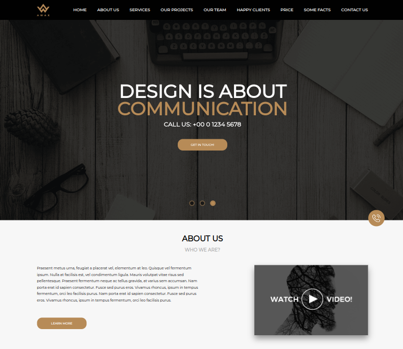
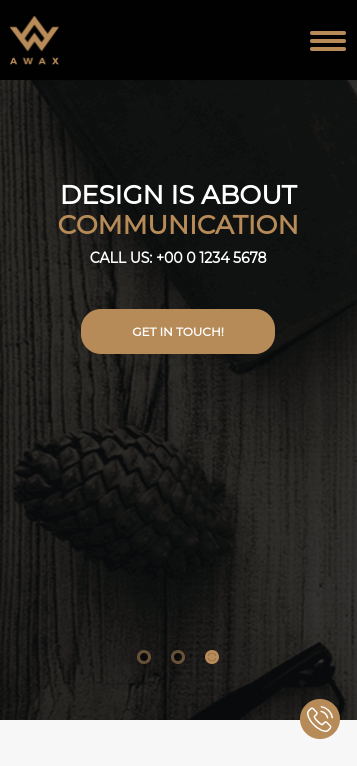

### AWAX

---

## Первая часть задачи:

- Выполнить верстку главной страницы по приложенному макету psd.
- Валидность и адаптивная вёрстка.
- Используя фреймворк Bootstrap.
- Pixel Perfect - не требуется.
- Для слайдера использовать готовые компоненты Bootstrap или Slick.
- Запрограммировать модальное окно, использовать компоненты Bootstrap, с формой обратной связи, по клику на иконку "Заказать звонок".

---

## Инструменты:

    

---

 
Итоговый результат можно увидеть по данной <a href="https://brahner.github.io/awax/">ссылке</a>

---

## Вторая часть задачи:

- На локальном сервере установить последнею версию WordPress.
- Формы обратной связи реализовать через плагин Contact Form 7.
- Запрограммировать наполнение контента на главной странице через поля в админке, используя плагин Advanced Custom Fields.
- Вывести карточки с помощью записей  (WP_Query). В качестве заголовка использовать слова из карт(Express, Standart, Luxe, Premium).
- Информацию ниже запрограммировать полями, используя плагин Advanced Custom Fields.
- После проделанной работы прикрепить полный бекап сайта (архив с файлами, дамп базы данных).

---

## Результат работы:

Ссылка на архив.

